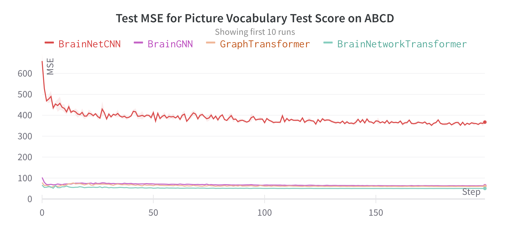

# Brain Network Transformer

Brain Network Transformer is the open-source implementation of the NeurIPS 2022 paper [Brain Network Transformer](https://arxiv.org/abs/2210.06681).


[](https://github.com/Wayfear/BrainNetworkTransformer)
[](https://github.com/Wayfear/BrainNetworkTransformer)


---


## Dataset

Download the ABIDE dataset from [here](https://drive.google.com/file/d/14UGsikYH_SQ-d_GvY2Um2oEHw3WNxDY3/view?usp=sharing).

## Usage

1. Change the *path* attribute in file *source/conf/dataset/ABIDE.yaml* to the path of your dataset.

2. Run the following command to train the model.

```bash
python -m source --multirun datasz=100p model=bnt,fbnetgen,brainnetcnn,transformer dataset=ABIDE,ABCD repeat_time=5 preprocess=mixup
```

- **datasz**, default=(10p, 20p, 30p, 40p, 50p, 60p, 70p, 80p, 90p, 100p). How much data to use for training. The value is a percentage of the total number of samples in the dataset. For example, 10p means 10% of the total number of samples in the training set.

- **model**, default=(bnt,fbnetgen,brainnetcnn,transformer). Which model to use. The value is a list of model names. For example, bnt means Brain Network Transformer, fbnetgen means FBNetGen, brainnetcnn means BrainNetCNN, transformer means VanillaTF.

- **dataset**, default=(ABIDE,ABCD). Which dataset to use. The value is a list of dataset names. For example, ABIDE means ABIDE, ABCD means ABCD.

- **repeat_time**, default=5. How many times to repeat the experiment. The value is an integer. For example, 5 means repeat 5 times.

- **preprocess**, default=(mixup, non_mixup). Which preprocess to applied. The value is a list of preprocess names. For example, mixup means mixup, non_mixup means the dataset is feeded into models without preprocess.


## Installation

```bash
conda create --name bnt python=3.9
conda install pytorch torchvision torchaudio cudatoolkit=11.3 -c pytorch
conda install -c conda-forge wandb
pip install hydra-core --upgrade
conda install -c conda-forge scikit-learn
conda install -c conda-forge pandas
```


## Dependencies

  - python=3.9
  - cudatoolkit=11.3
  - torchvision=0.13.1
  - pytorch=1.12.1
  - torchaudio=0.12.1
  - wandb=0.13.1
  - scikit-learn=1.1.1
  - pandas=1.4.3
  - hydra-core=1.2.0


## Regression Performance

We show regression performance which is not included in the paper. The results are the test MSE for the prediction of NIH Toolbox Picture Vocabulary Test Age 3+ v2.0 Uncorrected Standard Score, which is the "nihtbx_picvocab_uncorrected" in the [page](https://nda.nih.gov/data_structure.html?short_name=tlbx_cogsum01). From this figure, we can see that the performance of BNT (50.3) is the best among these models, with a large margin.




## Citation

Please cite our paper if you find this code useful for your work:
```bibtex
@inproceedings{
  kan2022bnt,
  title={BRAIN NETWORK TRANSFORMER},
  author={Xuan Kan and Wei Dai and Hejie Cui and Zilong Zhang and Ying Guo and Carl Yang},
  booktitle={Advances in Neural Information Processing Systems},
  year={2022},
}
```
